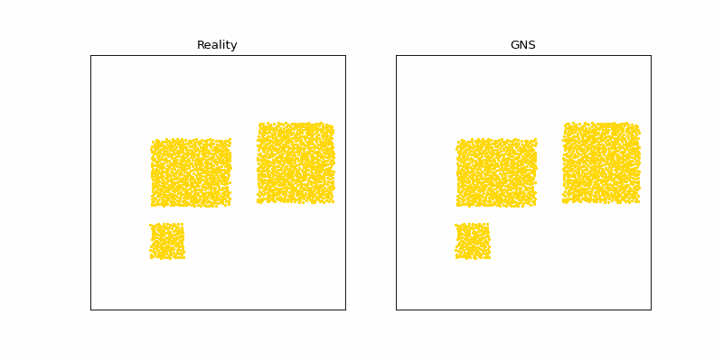

# Graph Network Simulator
> PyTorch version of Graph Network Simulator based on [https://arxiv.org/abs/2002.09405](https://arxiv.org/abs/2002.09405) and [https://github.com/deepmind/deepmind-research/tree/master/learning_to_simulate](https://github.com/deepmind/deepmind-research/tree/master/learning_to_simulate).

## Run GNS
> Training
```shell
export DATASET_NAME="Sand"
export WORK_DIR=${WORK_DIR}/
python3 -m gns.train --data_path="${WORK_DIR}/datasets/${DATASET_NAME}/" --model_path="${WORK_DIR}/models/${DATASET_NAME}/" --output_path="${WORK_DIR}/rollouts/${DATASET_NAME}/" -ntraining_steps=100
```

> Resume training

To resume training specify `model_file` and `train_state_file`:

```shell
export DATASET_NAME="Sand"
export WORK_DIR=${WORK_DIR}/
python3 -m gns.train --data_path="${WORK_DIR}/datasets/${DATASET_NAME}/" --model_path="${WORK_DIR}/models/${DATASET_NAME}/" --output_path="${WORK_DIR}/rollouts/${DATASET_NAME}/" --model_file="model.pt" --train_state_file="train_state.pt" -ntraining_steps=100
```

> Rollout
```shell
python3 -m gns.train --mode='rollout' --data_path='${WORK_DIR}/datasets/${DATASET_NAME}/' --model_path='${WORK_DIR}/models/${DATASET_NAME}/' --model_file='model.pt' --output_path='${WORK_DIR}/rollouts'
```

> Render
```shell
 python3 -m gns.render_rollout --rollout_path='${WORK_DIR}/rollouts/${DATASET_NAME}/rollout_0.pkl' 
```


> GNS prediction of Sand rollout after training for 2 million steps.

## Datasets

Datasets are available to download via:

* Metadata file with dataset information (sequence length, dimensionality, box bounds, default connectivity radius, statistics for normalization, ...):

  `https://storage.googleapis.com/learning-to-simulate-complex-physics/Datasets/{DATASET_NAME}/metadata.json`

* TFRecords containing data for all trajectories (particle types, positions, global context, ...):

  `https://storage.googleapis.com/learning-to-simulate-complex-physics/Datasets/{DATASET_NAME}/{DATASET_SPLIT}.tfrecord`

Where:

* `{DATASET_SPLIT}` is one of:
  * `train`
  * `valid`
  * `test`

* `{DATASET_NAME}` one of the datasets following the naming used in the paper:
  * `WaterDrop`
  * `Water`
  * `Sand`
  * `Goop`
  * `MultiMaterial`
  * `RandomFloor`
  * `WaterRamps`
  * `SandRamps`
  * `FluidShake`
  * `FluidShakeBox`
  * `Continuous`
  * `WaterDrop-XL`
  * `Water-3D`
  * `Sand-3D`
  * `Goop-3D`

The provided script `./download_dataset.sh` may be used to download all files from each dataset into a folder given its name.

An additional smaller dataset `${DATASET_NAME}`, which includes only the first two trajectories of `WaterDrop` for each split, is provided for debugging purposes.

### Download dataset (e.g., Sand)


```shell
    export DATASET_NAME="Sand"
    # local
    mkdir -p /tmp/datasets
    sh ./download_dataset.sh ${DATASET_NAME} /tmp/datasets
    
    # on frontera
    sh ./download_dataset.sh ${DATASET_NAME} ${SCRATCH}/gns
```

## Building environment on TACC LS6 and Frontera

- to setup a virtualenv

```shell
sh ./build_venv.sh
```

- check tests run sucessfully.
- start your environment

```shell
source start_venv.sh 
```
